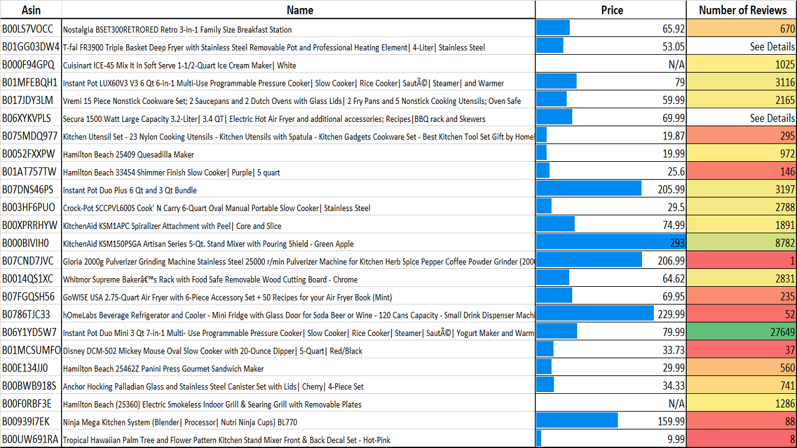
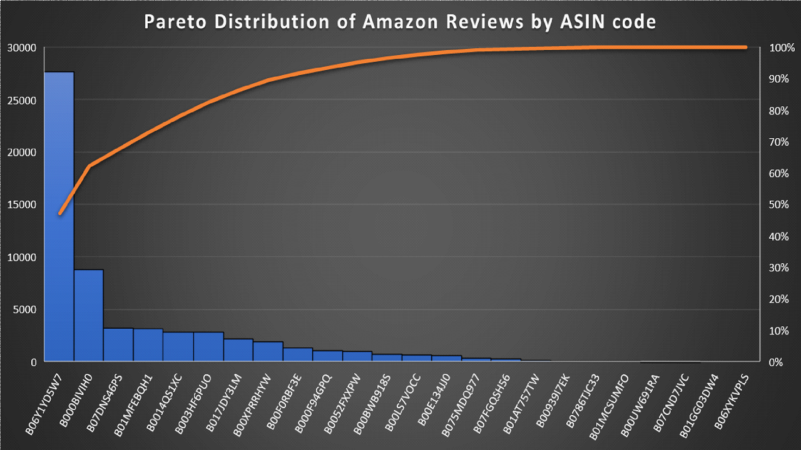

# AmazonScrapper

**NOTE**: This repo is no longer maintained due to constant CSS changes on amazon's website. Thank you! :-)

This project performs web-scraping on www.amazon.com with the Python package Beautiful Soup. The user can enter any product category and a *'csv'* file with the Amazon ASIN codes, product name, price, and number of reviews is generated. 

## How can this help you?
The initial inspiration for this project was to get a dump of Amazon ASIN codes, or ID's for any product category. API requests on those ASIN codes can give a detailed analysis of the inventory. However, services usually rate-limit your requests or make you pay a decent fee. This can be a problem, as I found out when tracking kitchen-ware over a month to visualize fluctuations. Thus, I decided to make a minimal but effective version which doesn't need any API requests.  

As the images below will indicate, this can also be invaluable to small and new business in trying to gauge competition. Additionally, investors can use this to monitor an entire commodity space. 

#### Product Analysis

#### Review Distribution

## Further improvements 
- Make this project more dynamic and deploy it in a presentable manner. 
- There can be better validation for text-parsing. Regex was experimented with but not used in this version.
- Amazon also displays products on their webpage in several different arrangements. This means different HTML elements and CSS classes, leading to more edge-cases. I have heavily tested different product categories to account for this but a deep-dive may reveal a generic way.

## Getting Started
If you have little Python experience, you can find plenty of resources on the internet to learn how to execute a Python file, clone a Github project on your local machine, or use external packages like [BeautifulSoup](https://www.crummy.com/software/BeautifulSoup/bs4/doc/). 

 - *Environment*: Here's a simple guide to help you install both Python 2.7 and Python 3.6 on [Windows 10](https://datascience.com.co/how-to-install-python-2-7-and-3-6-in-windows-10-add-python-path-281e7eae62a)

## Contributing

Please shoot me an email at sarthakbatra1993@gmail.com with the title 'Contributing to AmazonScrapper' if you have suggestions on how to make it better or would want to know more about pull requests.

## Authors

* **Sarthak Batra** - *Initial work* - [My Github](https://github.com/sarthakbatragatech)

## License

This project is licensed under the MIT License - see the [LICENSE.md](LICENSE.md) file for details
